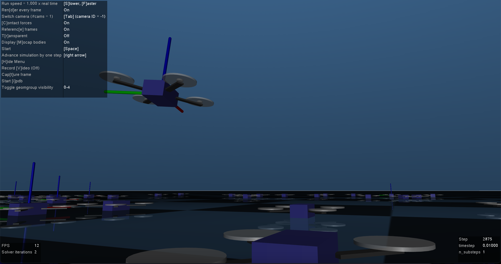

# mj-SaberFlocking
MuJoCo simulation test bed utilizing multi-agent flocking algorithms from Olfati-Saber

## Getting Started
### Install MuJoCo Binaries for Linux or OSX (Windows Support Deprecated)
- [Linux](https://mujoco.org/download/mujoco210-linux-x86_64.tar.gz)
- [OSX](https://mujoco.org/download/mujoco210-macos-x86_64.tar.gz)
- Extract the downloaded `mujoco210` directory into `~/.mujoco/mujoco210`
### Install Requirements
`pip3 install -r requirements.txt`
### Run a test
`python3 scripts/gen_Ndrones.py [N number of drones you want]`

`python3 src/test.py model/Ndrones.xml`

### Flocking Algorithm 1
`python3 src/algo1.py model/Ndrones.xml`

## Notes
- The code is well documented
- Currently `test.py` will order all `N` quadrotors to follow the same circular motion trajectory

## Acknowledgments
Developed at Lehigh AirLab by Brian Zhu with help from Neeraj Gandhi, Jiawei Xu and Diego S. D'antonio under supervision of David Saldana

## References
- R. Olfati-Saber, "[Flocking for multi-agent dynamic systems: algorithms and theory,](https://ieeexplore.ieee.org/document/1605401)" in IEEE Transactions on Automatic Control, vol. 51, no. 3, pp. 401-420, March 2006, doi: 10.1109/TAC.2005.864190.
- T. Lee, M. Leok and N. H. McClamroch, "[Geometric tracking control of a quadrotor UAV on SE(3),](https://www.math.ucsd.edu/~mleok/pdf/LeLeMc2010_quadrotor.pdf)" 49th IEEE Conference on Decision and Control (CDC), 2010, pp. 5420-5425, doi: 10.1109/CDC.2010.5717652.
